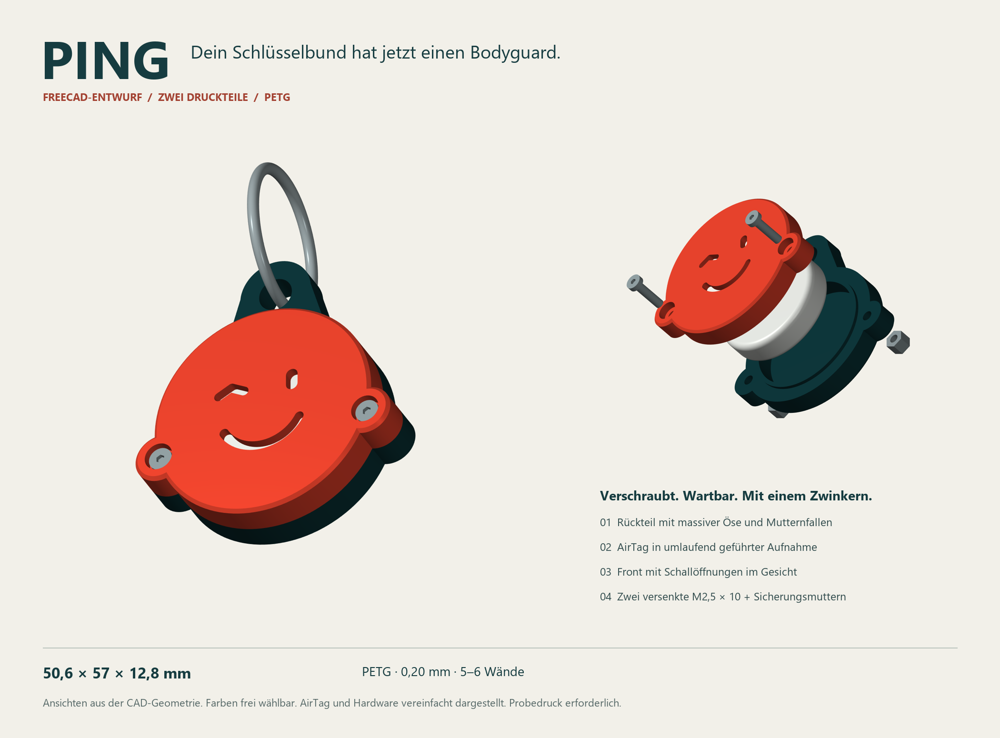

# PING · der kleine Schlüsselwächter

**Ein AirTag-Cover für den Schlüsselbund – in FreeCAD konstruiert, mit zwei PETG-Druckteilen, zwei gesicherten Schrauben und einem Zwinkern.**

Dieses öffentliche Repository dokumentiert den Entwurf und macht die Dateien, den Erzeugungscode und die Prüfmethoden zugänglich. **Stand: digital geprüfter Konstruktionsprototyp; noch nicht physisch gedruckt oder belastungsgeprüft.**



## Direkt zu den Dateien

| Zweck | Datei |
|---|---|
| In FreeCAD bearbeiten | [PING_AirTag.FCStd](PING_AirTag.FCStd) |
| Rückteil drucken | [PING_Rueckteil.stl](PING_Rueckteil.stl) |
| Front drucken | [PING_Front.stl](PING_Front.stl) |
| In anderer CAD-Software öffnen | [PING_Montage.step](PING_Montage.step) |
| Druck, Teileliste und Montage | [Bebilderte Anleitung](README_Druck_und_Montage.md) |
| Erzeugung nachvollziehen | [FreeCAD-Makro](PING_erzeugen.FCMacro) · [Reproduktion](docs/REPRODUZIEREN.md) |
| Ergebnis überprüfen | [Prüfprogramm](verify_model.py) · [Prüfbericht](Pruefbericht.json) · [Prüfmethoden](docs/PRUEFUNG.md) |
| Herkunft und Entscheidungen | [Entwurfsdokumentation](docs/ENTWURF_UND_HERKUNFT.md) |

Einzeldateien über **Download raw file** herunterladen oder das gesamte Repository mit **Code → Download ZIP** beziehen. STL- und CAD-Dateien sind echte binäre Dateien, keine Git-LFS-Platzhalter.

## Konstruktion

- **50,6 × 57 × 12,8 mm** ohne Schlüsselring; Aufnahme Ø32,5 × 8,6 mm für den dokumentierten AirTag-Hüllraum Ø31,9 × 8,0 mm.
- Integrierte Öse im Rückteil: 6,4 mm dick, Ringöffnung Ø6,5 mm.
- Umlaufende Zentrierlippe; Front mit Gesicht als Schallöffnung.
- Zwei **M2,5×10-Linsenkopfschrauben** und zwei **selbstsichernde M2,5-Muttern, SW5 × 3,8 mm**. Genaue Anforderungen stehen in der [Stückliste](README_Druck_und_Montage.md#einkaufsliste).
- Für einen FDM-Drucker mit 0,4-mm-Düse und PETG ausgelegt. Startwerte: 0,20-mm-Schichten, 5–6 Wände, 40–50 % Infill. Beide STLs liegen bereits in Drucklage. Ein konkretes Drucker-/Filamentprofil wurde noch nicht erprobt.

Das Modell enthält native FreeCAD-Bodies, Skizzen, Pads, Pockets und Fasen. Die Tabelle steuert Funktionsmaße; Außenkontur, Gesicht, Schraubenpositionen und Muttern-Sechskante sind fixierte, bearbeitbare Skizzen. Es ist **kein vollständig skalierbares Universalgehäuse**.

## Was ist überprüft?

Die lokale FreeCAD-Prüfung öffnet das gespeicherte Modell erneut und kontrolliert Körpergültigkeit, Außenmaße, Kollisionen mit AirTag und Hardware sowie STEP- und STL-Exporte. Die Prüfprogramme, Toleranzen und Ergebnisse stehen offen im Repository.

Der GitHub-Workflow prüft **SHA-256-Dateiintegrität und Python-Syntax**, nicht die CAD-Geometrie. Für Letztere ist eine lokale FreeCAD-Laufzeit erforderlich. Prüfsummen sichern die Konsistenz dieses Dateistands; sie sind kein unabhängiger Sicherheitsnachweis.

**Noch offen:** Passung mit realem AirTag, Klappern, Drucktoleranzen, Signalton/Funkfunktion, Schraubensicherung sowie Zug-, Verdreh- und Falltests. Es gibt keine zugesicherte Bruchlast, keine FEM und keine Einstufung als unzerbrechlich. Hinweise dazu und eine ausfüllbare [Testvorlage](docs/PROBEDRUCK_PROTOKOLL.md) helfen bei der weiteren Erprobung.

## Kurz überprüfen

Ohne FreeCAD, mit Python 3:

```console
python verify_files.py
```

Mit der zu FreeCAD gehörenden Python-Laufzeit unter Windows, aus dem Repository-Ordner:

```powershell
& 'C:\Program Files\FreeCAD 1.1\bin\python.exe' .\verify_model.py
```

Ergebnis: `build/Pruefbericht.json`. Details, vollständige Neu-Erzeugung und bekannte Plattformgrenzen: [Reproduzieren](docs/REPRODUZIEREN.md).

## Quellen, Beiträge und Nutzungsrechte

Der Entwurf wurde im Dialog mit OpenAI Codex erstellt und mit FreeCAD 1.1.3 umgesetzt. Die Ansichten stammen aus CAD-Geometrie; AirTag und Metallteile sind vereinfacht dargestellt. Maße und Materialquellen sind in der [Anleitung](README_Druck_und_Montage.md#quellen-und-eigene-festlegungen) verlinkt. Keine Verbindung zu oder Freigabe durch Apple.

Beobachtungen können als Issue mit Drucker, Material, Profil, Commit und Fotos dokumentiert werden. Bitte geometrische Prüfung und reale Erprobung getrennt ausweisen.

Für dieses öffentliche Dokumentationsrepository wurde bislang **keine gesonderte freie Nachnutzungslizenz festgelegt**. Eine solche Lizenz wird nicht allein aus der öffentlichen Sichtbarkeit abgeleitet.

*English: PING is a FreeCAD AirTag keychain enclosure. CAD, printable STLs, STEP, generator, validation scripts and documentation are provided for inspection. Digitally checked prototype; physical testing is still pending.*
