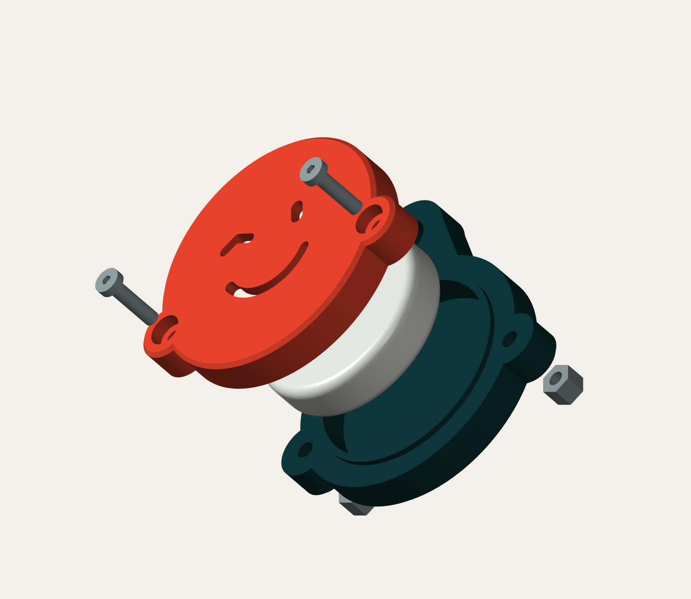

# PING – der kleine Schlüsselwächter

Ein zwinkerndes AirTag-Cover mit massiver Öse, zwei versenkten Schrauben und wartbarem Gehäuse. Entworfen und geprüft mit FreeCAD 1.1.3, 13.09.2026. **Konstruktionsstand: druckbarer Prototyp, noch kein physisch erprobtes Produkt.**

## Dateien

| Datei | Verwendung |
|---|---|
| `PING_AirTag.FCStd` | Native FreeCAD-Datei mit zwei Bodies, Skizzen, Pads, Pockets, Fasen und Parametertabelle. Hälften in Montageposition. |
| `PING_Rueckteil.stl` | Einmal drucken, bereits in Drucklage. |
| `PING_Front.stl` | Einmal drucken, bereits in Drucklage. |
| `PING_Montage.step` | Zwei getrennte Körper zum Austausch mit anderer CAD-Software; Montageposition. |
| `PING_erzeugen.FCMacro` | Reproduzierbarer Erzeuger für FreeCAD; schreibt standardmäßig in `build/`. Ein vorhandener gleichnamiger Stand in diesem Ausgabeordner wird überschrieben. |
| `Pruefbericht.json` | Ergebnisse der digitalen Geometrieprüfung. |

## Maße und Aufbau

| Merkmal | CAD-Nennmaß |
|---|---:|
| Komplettes Cover ohne Schlüsselring | 50,6 × 57,0 × 12,8 mm |
| Hauptscheibe | Ø43,0 mm |
| AirTag-Aufnahme | Ø32,5 × 8,6 mm |
| Zugrunde gelegter AirTag | Ø31,9 × 8,0 mm |
| Spiel für AirTag | 0,3 mm radial, insgesamt 0,6 mm in der Höhe |
| Frontwand und Boden | je 2,1 mm |
| Öse | 6,4 mm dick, Außenradius 7,0 mm |
| Schlüsselringöffnung | Ø6,5 mm; nominell 3,75 mm Material bis Außenrand oben |
| Umlaufende Führung | 1,0 mm hoch, 1,2 mm breit |
| Führungsspiel | 0,25 mm radial und axial |
| Schraubendurchgänge | Ø2,9 mm |
| Kopftaschen | Ø5,4 × 2,4 mm tief |
| Mutternfallen | SW5,35 × 4,8 mm tief |

Die Schlüsselringlast geht direkt in das Rückteil. Die Front verschließt den AirTag mit zwei Schrauben. Die umlaufende Lippe führt die Hälften und unterstützt sie gegen seitliche Verschiebung. Augen und Mund sind durchgehende Schallöffnungen. Die Front deckt den AirTag weitgehend ab, bietet durch diese Öffnungen aber keinen vollständigen Kratz- oder zusätzlichen Wasserschutz.

## Material und Druck

**Voreinstellung: FDM, PETG, Düse 0,4 mm.** Drucker und Material wurden nicht näher genannt. Petrol/Anthrazit hinten und Koralle/Orange vorne funktionieren ohne Mehrfarbdruck: jedes Teil erhält eine Filamentfarbe.

- Beide STL-Dateien in **Millimetern und mit 100 % Skalierung** importieren. Sie liegen mit der flachen Außenseite auf Z=0; die offenen Innenseiten zeigen nach oben.
- Schichthöhe 0,20 mm; 5–6 Wandlinien; mindestens 6 Boden-/Deckschichten; 40–50 % Gyroid als Startwert. Öse und Schraubenohren im Slicer bei Bedarf mit einem 100-%-Infill-Modifikator versehen. Mit dieser Wandzahl werden die schmalen Bereiche ohnehin weitgehend massiv.
- Normalerweise ohne Stützmaterial druckbar. In der Schichtvorschau besonders die kurzen Brücken über Kopf- und Mutternfallen prüfen. Falls das PETG-Profil dort unsauber brückt, lokal Stützen setzen oder das Brückenprofil anpassen.
- Materialtemperaturen und Kühlung nach dem bewährten Profil für das konkrete Filament wählen. Trockene PETG-Rolle verwenden. Kein ungeprüfter Universal-Temperaturwert.
- Die Außenfase reduziert scharfe Druckbettkanten. Einen verbliebenen Elefantenfuß an Bohrungen und Passflächen vorsichtig entgraten. Die funktionale Zentrierlippe nicht abschleifen, solange sie bereits leichtgängig passt.
- PLA eignet sich für einen ersten Formtest. Für die vorgesehene Nutzung ist zähes PETG die Ausgangsempfehlung. [Prusa: PETG](https://help.prusa3d.com/article/petg_2059)

## Einkaufsliste

| Anzahl | Teil | Maßanforderung |
|---:|---|---|
| 2 | M2,5 × 10 mm Linsenkopf-Innensechskantschraube, z. B. ISO 7380-1 | Länge **unter dem Kopf** 10 mm, Kopf Ø maximal 4,5 mm, Kopfhöhe maximal 1,5 mm; Vollgewinde. Keine Senkkopfschraube. |
| 2 | Selbstsichernde M2,5-Sechskantmutter mit Nylonring | SW5,0 mm, Gesamthöhe 3,8 mm. Tatsächliches Lieferteil nachmessen; abweichende Bauformen sind möglich. |
| 1 | Geschlossener geteilter Schlüsselring aus Stahl | Etwa 28–30 mm außen, Draht etwa 2,0–2,2 mm. Virtuell geprüft: Ø29,2 mm außen / Draht Ø2,2 mm, als vereinfachter geschlossener Ring. |
| optional | Sehr dünne weiche Schaum-/Filzauflage | Nur falls der reale AirTag klappert; zunächst 0,3 mm dick und etwa Ø8–10 mm, zentral auf dem hinteren Boden. |

Keine Gewindeeinsätze, kein Klebstoff und keine gedruckten Gewinde nötig. Die selbstsichernden Muttern erschweren ein selbstständiges Losdrehen. Die Rückhaltung ist trotzdem regelmäßig am realen Schlüsselbund zu kontrollieren.

## Montage

1. Beide Teile entgraten. Zuerst ohne AirTag trocken zusammenstecken: Die Lippe muss in die Front gleiten und die umlaufende Trennfuge muss vollständig schließen.
2. Die beiden Muttern von der **Außenseite des Rückteils** in die Sechskanttaschen drücken. Metallische Auflagefläche tief in die Tasche, Nylonring nach außen. Die Muttern liegen anschließend ungefähr 1 mm unter der Rückseite. Beim ersten Einschrauben mit einem passenden Werkzeug gegenhalten, wenn sie noch lose sitzen.
3. Den AirTag ins Rückteil legen. Die verwendete digitale Prüfung basiert bewusst auf dem vollständigen Ø31,9 × 8,0-mm-Hüllzylinder; die genaue gewölbte Herstellerkontur wurde nicht nachmodelliert. Bei fühlbarem Spiel eine dünne zentrale weiche Auflage ergänzen. Nicht so viel unterlegen, dass die Fuge beim Schließen offen bleibt.
4. Die Front aufsetzen. Zwei M2,5×10-Schrauben von vorne einsetzen und abwechselnd vorsichtig von Hand anziehen. Die Flächen sollen satt anliegen, ohne sichtbare Verformung. Die Sicherungsmutter erzeugt schon vor dem Anschlag Widerstand; deshalb nicht allein nach dem Drehgefühl beurteilen.
5. Prüfen: Schraubenenden bleiben nominal 0,4 mm innerhalb des Rückteils und reichen 0,6 mm durch die vollständig eingesetzte 3,8-mm-Mutter. Beide Schrauben müssen durch den Nylonbereich greifen. Bei abweichender Mutterhöhe die Länge neu prüfen.
6. Schlüsselring durch die Öse ziehen. Anschließend den AirTag-Signalton, Erkennung und gegebenenfalls Präzisionssuche mit dem eigenen Gerät testen.

Zum Batteriewechsel beide Schrauben lösen und die Front abheben. Der Schlüsselring kann am Rückteil bleiben. Bei häufigem Öffnen Muttern mit nachlassender Sicherungswirkung ersetzen.

## In FreeCAD weiterbearbeiten

`PING_AirTag.FCStd` öffnen. Die Tabelle **01 · Maße und Druckspiel (mm)** steuert die verknüpften Durchmesser und Tiefen. Für kleine Drucktoleranzkorrekturen beispielsweise den Aufnahmedurchmesser von 32,5 auf 32,7 mm ändern und neu berechnen.

Die Außenkonturen, Schraubenpositionen, das Gesicht und die SW5,35-Sechskantkonturen sind fixierte native Skizzengeometrie. Sie bleiben bearbeitbar, sind aber **nicht vollständig durch die Tabelle gesteuert**. Insbesondere `NutAF` dokumentiert das Nennmaß; die Muttern-SW muss in `BNutSketch` bzw. im Erzeugermakro geändert werden. Für eine andere AirTag-Größe oder wesentlich andere Schrauben müssen die Konturen mit angepasst werden. Das Referenzobjekt „AirTag Hüllzylinder“ ist eine feste Prüfhilfe.

Bei geänderten Wand-/Schalenhöhen erneut Schraubenlänge und Eingriff prüfen. Das Modell ist in Montageposition gespeichert; **die mitgelieferten STL-Dateien sind bereits korrekt für den Druck gedreht**. Nach Änderungen neue STL-Dateien exportieren und die Front so drehen, dass die plane Außenseite unten liegt. Das Erzeugermakro schreibt seine Ausgangsparameter; es übernimmt keine nachträglich im FCStd geänderten Werte.

## Geprüft und noch offen

Digital bestanden: gültige Einzelvolumenkörper, vollständige Außenkonturen, kollisionsfreie Hälften, freier AirTag-Hüllzylinder, passende Schrauben und Muttern, Beispielring kollisionsfrei, STEP mit zwei Körpern, zwei geschlossene STL-Netze mit je einer Komponente und Druckbett-Z=0. Die Vorschau wurde aus diesen CAD-Körpern gerendert, nicht als Fantasiebild erzeugt.

**Noch erforderlich:** realer Probedruck, Passprobe, Klapperprüfung, Signalton-/Funktionstest sowie Zug-, Verdreh- und Fallprüfung für eure Druckeinstellungen. Nicht auf „unzerbrechlich“ oder eine bestimmte Bruchlast getestet; keine FEM und keine Freigabe für sicherheitsrelevante Befestigung. Zum ersten Belastungstest einen Dummy verwenden. Bei Weißbruch, Rissen, ausgeschlagener Öse oder lockerer Verschraubung nicht weiter am Schlüsselbund verwenden.

## Quellen und eigene Festlegungen

- AirTag-Außenmaße 2021: [Apple Support](https://support.apple.com/en-euro/111847).
- AirTag-Außenmaße 2026: [Apple Support](https://support.apple.com/en-gb/126203). Beide Quellen geben Ø31,9 × 8,0 mm an. Die digitale Passprüfung deckt diesen Hüllraum ab; eine reale Passprobe mit beiden Generationen wurde nicht durchgeführt.
- M2,5-Mutternmaß SW5 / H3,8: [Westfield Fasteners – Maßblatt](https://www.westfieldfasteners.co.uk/Datasheets/Nut_HexNy_M.pdf).
- PETG-Materialcharakteristik: [Prusa Knowledge Base](https://help.prusa3d.com/article/petg_2059).
- Gehäusegeometrie, Spiel, Verschraubungsanordnung und Druck-Startwerte sind eigene konstruktive Festlegungen.
