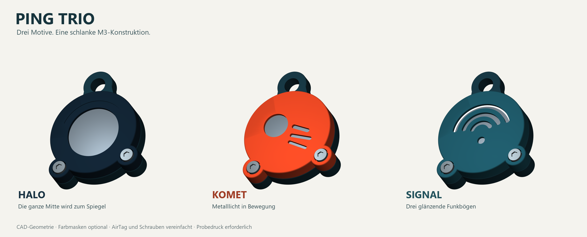

# PING · sechs Motive für das schlanke AirTag-Cover




**Sechs Frontmotive, ein gemeinsames Rückteil.** Die polierte Edelstahl-Batterieabdeckung des AirTags zeigt zur Motivfront und bildet den sichtbaren Metallakzent. Die drei neuen Gesichter übernehmen die typischen Formen der Vorlagen: rote Herzaugen und breites Lächeln, Hände an den Wangen mit aufgerissenen Augen und Mund sowie zwei Hände vor dem Gesicht mit einem freien Auge. Bei 😱 und 🫣 formen die Hände sogar die Außenkontur mit. Die Vorschauen zeigen die gespeicherte CAD-Geometrie samt optionalen Farbmasken; AirTag und Schrauben sind vereinfacht dargestellt. Diese Varianten sind digital geprüft, **noch nicht probeweise gedruckt oder belastungsgeprüft**.

## Varianten und Dateien

| Motiv | Wirkung | FreeCAD | Front-STL | STEP | Vorschau |
|---|---|---|---|---|---|
| Halo | Große runde Öffnung als Metallspiegel, feine Bogenrille | [FCStd](CAD/PING_Trio_Halo.FCStd) | [STL](CAD/PING_Trio_Halo_Front.stl) | [STEP](CAD/PING_Trio_Halo.step) | [PNG](CAD/PING_Trio_Halo_Vorschau.png) |
| Komet | Versetzter Metallkern mit drei diagonalen Spuren | [FCStd](CAD/PING_Trio_Komet.FCStd) | [STL](CAD/PING_Trio_Komet_Front.stl) | [STEP](CAD/PING_Trio_Komet.step) | [PNG](CAD/PING_Trio_Komet_Vorschau.png) |
| Signal | Drei gestaffelte Bögen mit Metallglanz | [FCStd](CAD/PING_Trio_Signal.FCStd) | [STL](CAD/PING_Trio_Signal_Front.stl) | [STEP](CAD/PING_Trio_Signal.step) | [PNG](CAD/PING_Trio_Signal_Vorschau.png) |
| Herzaugen 😍 | Große rote Herzflächen mit kleinen Metallreflexen und breites Lächeln | [FCStd](CAD/PING_Trio_Herzaugen.FCStd) | [STL](CAD/PING_Trio_Herzaugen_Front.stl) | [STEP](CAD/PING_Trio_Herzaugen.step) | [PNG](CAD/PING_Trio_Herzaugen_Vorschau.png) |
| Schock 😱 | Hände an den Wangen, weite Augen, hoher ovaler Mund, blaue Stirn | [FCStd](CAD/PING_Trio_Schock.FCStd) | [STL](CAD/PING_Trio_Schock_Front.stl) | [STEP](CAD/PING_Trio_Schock.step) | [PNG](CAD/PING_Trio_Schock_Vorschau.png) |
| Peek 🫣 | Zwei Hände vor dem Gesicht, Fingerzwischenräume aus Metall, freies Auge | [FCStd](CAD/PING_Trio_Peek.FCStd) | [STL](CAD/PING_Trio_Peek_Front.stl) | [STEP](CAD/PING_Trio_Peek.step) | [PNG](CAD/PING_Trio_Peek_Vorschau.png) |

Die Tabelle zeigt die **schlanke M3×8-Ausführung**. Für M3×10 gibt es zu jedem Motiv eine eigene Front mit dem Suffix `_M3x10`, beispielsweise [Herzaugen M3×10 als FCStd](CAD/PING_Trio_Herzaugen_M3x10.FCStd), [STL](CAD/PING_Trio_Herzaugen_M3x10_Front.stl) und [STEP](CAD/PING_Trio_Herzaugen_M3x10.step). Für jedes Motiv einmal das [gemeinsame Rückteil](CAD/PING_Trio_Rueckteil.stl) und **die zur Schraubenlänge passende Front** drucken. Der [Generator](CAD_erzeugen.py) erzeugt alle CAD-, STEP- und STL-Dateien neu. Der [Prüfcode](pruefen.py) prüft beide Schraubenlängen. [Erzeugungsbericht](CAD/Erzeugungsbericht.json) und [Prüfbericht](CAD/Pruefbericht.json) dokumentieren den vorliegenden Stand.

### Emoji-Farben drucken oder einfarbig lassen

Die drei Emoji-Fronten haben **0,4 mm tiefe, geometrisch ausgeformte Farbflächen**. Für einen einfarbigen Druck genügt die jeweilige `Front.stl`; Herzaugen, Stirn und Hände bleiben als Vertiefungen erkennbar und lassen sich bei Bedarf mit Farbe auslegen. Die Metallfenster sind echte Öffnungen zur AirTag-Kappe.

Für einen Multimaterialdruck die passende Front zusammen mit ihren **Farbmasken-STLs in derselben Lage als Teile eines Objekts** importieren und die Materialien zuweisen. Die Farbmasken sind bündige, passgenaue CAD-Teile für den gemeinsamen Druck, keine einzeln auf dem Druckbett zu druckenden Einleger. Ihre Z-Koordinaten liegen wie bei der Front zwischen 0 und 0,4 mm. Die CAD-Vorschauen zeigen diese Variante. Alle Farbmasken sind in den FreeCAD-Dateien als separate Objekte enthalten:

| Emoji | Farbmasken |
|---|---|
| 😍 Herzaugen | [Rot](CAD/PING_Trio_Herzaugen_Rot_Farbmaske.stl) |
| 😱 Schock | [Orange (Hände)](CAD/PING_Trio_Schock_Orange_Farbmaske.stl), [Blau (Stirn)](CAD/PING_Trio_Schock_Blau_Farbmaske.stl) |
| 🫣 Peek | [Ocker (Hände)](CAD/PING_Trio_Peek_Ocker_Farbmaske.stl) |

Beim Slicen die erste Schicht und die Materialgrenzen kontrollieren. Die Farbmasken sind für M3×8 und M3×10 gleich; die Front selbst muss zur Schraubenlänge passen.

## Maße und Konstruktion

| Merkmal | Trio | Bisheriges PING |
|---|---:|---:|
| Außenmaß des Kunststoffs ohne Ring | 39,6 × 50,7 × 11,0 mm; mit Handkontur 43,6 × 50,7 × 11,0 mm | 50,6 × 57,0 × 12,8 mm |
| Höhe mit den fotografierten M3-Zylinderköpfen | ca. 11,6 mm (M3×8), 13,0 mm (M3×10) | 12,8 mm mit versenkten M2,5-Köpfen |
| Hauptscheibe | Ø38,4 mm | Ø43,0 mm |
| AirTag-Aufnahme | Ø32,5 × 8,6 mm | Ø32,5 × 8,6 mm |
| Außenkanten der runden Scheiben | Radius 0,45 mm | Fase 0,65 mm |
| Rechnerisches Kunststoffvolumen der zwei Schalen, je nach Motiv und Schraubenlänge | 6,28–6,84 cm³ | 12,77 cm³ |

Das modellierte Kunststoffvolumen der Schalen sinkt um **46,4–50,8 %**. Optionale Farbmasken kommen hinzu. Das ist eine CAD-Volumenrechnung, keine gemessene Druckmasse. Die M3×8-Version erreicht die gewünschte geringere Gesamtdicke; bei M3×10 stehen die höheren Köpfe um 2,0 mm über. Die Schraubpunkte liegen diagonal im Rand der Scheibe, statt als seitliche Ohren weit herauszuragen. Die AirTag-Aufnahme behält das bisherige Nennspiel: Ø31,9 × 8,0 mm AirTag-Hüllraum in Ø32,5 × 8,6 mm Aufnahme, also 0,3 mm radial und axial je Seite. Die Front hält den AirTag mit einem umlaufenden Rand fest; eine Zentrierlippe führt die Hälften.

Die runden Außenkanten sind verrundet. Die Ränder der Motivöffnungen sind drucktechnisch bewusst scharf: Sie liegen in der nur 1,2 mm starken Frontfläche und sollen ihre Form behalten. Sichtbare Schnittkanten können nach dem Druck vorsichtig entgratet werden.

## Schrauben und Muttern

Das Foto des vorhandenen Sets zeigt **M3-Innensechskantschrauben mit zylindrischem Kopf**, Längen M3×8 und M3×10, sowie Sechskantmuttern. Die exakten Maße des gelieferten Sets lassen sich aus dem Foto nicht sicher bestimmen. Das CAD verwendet deshalb die üblichen M3-Maße für Zylinderkopfschrauben nach ISO 4762 / DIN 912 und normale Muttern nach DIN 934. **Für die dünne Ausführung M3×8 verwenden**; für M3×10 die eigene, höher aufbauende Front wählen.

| Hardwaremaß | CAD-Annahme |
|---|---:|
| Schraubendurchgang | Ø3,4 mm |
| Kopf (ISO 4762 / DIN 912, Zylinderkopf) | Ø≤5,5 mm, Höhe ≤3,0 mm |
| Kopftasche | Ø6,3 × 2,4 mm (M3×8) bzw. × 1,0 mm (M3×10) |
| Kopfüberstand bei 3,0 mm Kopfhöhe | 0,6 mm (M3×8) bzw. 2,0 mm (M3×10) |
| Mutter (DIN 934 / vergleichbar) | SW5,5 mm, Höhe etwa 2,4 mm |
| Mutternfalle | SW5,8 × 4,0 mm tief |
| Gewindeeingriff in 2,4-mm-Mutter | durchgehend bei beiden Längen, wenn die Mutter am Taschenende sitzt |
| Schraubenende | M3×8 um 0,6 mm innen; M3×10 bündig zur Rückseite, ohne Toleranzreserve |

**Keine Senkkopfschrauben und keine Sicherungsmuttern ohne erneute Maßprüfung verwenden.** Die Taschen sind auf normale Sechskantmuttern ausgelegt. Die Fotos belegen weder Mutterhöhe noch Sicherungsring. Da normale Muttern sich lockern können, die Verschraubung am realen Schlüsselbund regelmäßig kontrollieren. Insbesondere M3×10 hat am Rücken keine zusätzliche Längenreserve. Eine M3×10-Schraube mit der tiefen M3×8-Front würde hinten etwa 1,4 mm herausragen; diese Kombination nicht montieren.

## Drucken und montieren

1. Beide STLs in Millimetern bei 100 % importieren. Sie liegen mit der flachen Außenseite auf **Z=0** und der offenen Innenseite nach oben. PETG mit 0,4-mm-Düse und 0,20-mm-Schichten ist der konstruktive Ausgangspunkt. Für die 1,2-mm-Flächen mindestens sechs geschlossene Schichten vorsehen. Die Öse und die Schraubpunkte in der Schichtvorschau prüfen; ein konkretes Druckerprofil ist noch nicht erprobt.
2. Die Teile entgraten. Die zwei M3-Muttern von hinten in die Sechskanttaschen bis an deren Dach drücken. Front und Rückteil ohne AirTag probeweise zusammenfügen. Die Zentrierlippe muss leicht hineingehen, ohne die Fuge offen zu halten.
3. Den AirTag mit der **polierten Edelstahlseite zur Motivfront** einlegen. Die drei kleinen Öffnungen im Rückteil zeigen zur weißen Seite. Bei klapperndem Sitz allenfalls eine dünne weiche Auflage ausprobieren und danach prüfen, ob die Hälften vollständig schließen.
4. Zwei gleich lange M3-Schrauben passend zur gewählten Front von vorne abwechselnd handfest anziehen. Die Köpfe stehen nominell 0,6 mm (M3×8) oder 2,0 mm (M3×10) über der Front. M3×10 muss am Rücken bündig bleiben; M3×8 endet nominell 0,6 mm vor der Rückfläche und durchgreift eine 2,4-mm-Mutter. Keinesfalls durch stärkeres Anziehen eine offene Fuge erzwingen.
5. Einen Schlüsselring durch Ø6,5 mm Ösenloch führen. Danach Sitz, Lockerung, AirTag-Erkennung, Signalton und gegebenenfalls Präzisionssuche am eigenen Gerät prüfen. Vor dem täglichen Einsatz einen Probedruck mit Dummy und Belastungsprobe der Öse machen.

Die Metallseite bleibt durch die Motivöffnungen berührbar und kann verkratzen. Das Gehäuse ist nicht dicht. Akustik, Funk, Passung, Verschleiß der Öse und Dauerfestigkeit sind noch nicht physisch gemessen.

## Reproduktion und Bearbeitung

Getestet mit **FreeCAD 1.0.1** und dessen gebündeltem Python unter Windows:

```powershell
& 'C:\Program Files\FreeCAD 1.0\bin\python.exe' .\trio\CAD_erzeugen.py
& 'C:\Program Files\FreeCAD 1.0\bin\python.exe' .\trio\pruefen.py
& 'C:\Program Files\FreeCAD 1.0\bin\python.exe' .\trio\rendern.py
python .\verify_files.py
```

Die FCStd-Dateien enthalten pro Variante zwei native FreeCAD-Bodies, eine Maßtabelle und bei den Emoji-Varianten separate Farbmasken-Objekte. Die Körper sind durch den Python-Generator erzeugte `PartDesign::Feature`-Volumenkörper. **Die Maßtabelle steuert die Geometrie nicht automatisch**; für Änderungen an Durchmessern, Motiven oder Schraubentyp den Generator anpassen und CAD, STLs, STEP, Prüfung und Prüfsummen neu erzeugen. Das bisherige PING im Repository bleibt als eigener Stand erhalten.

## Quellen und Annahmen

- Apple nennt für AirTag und AirTag (2. Generation) jeweils Ø31,9 × 8,0 mm: [AirTag](https://support.apple.com/en-ca/111847), [AirTag 2](https://support.apple.com/de-de/126203). Apple bezeichnet den Batteriedeckel als polierten Edelstahl: [Batteriewechsel](https://support.apple.com/en-us/102600).
- Die für den neuen Schraubentyp angesetzten M3-Zylinderkopfmaße Ø5,5 / H3,0 mm entsprechen beispielsweise dem [ISO-4762-M3-Datenblatt von pgb-Europe](https://www.pgb-europe.com/en-gb/20812/socket-cap-screw-8-8-iso4762-m3x16-zp). Der vorhandene Satz ist laut Verpackung aus 304-Edelstahl; seine Maße müssen am realen Teil überprüft werden.
- Für die normale M3-Sechskantmutter werden SW5,5 mm und H2,4 mm aus dem [DIN-934-Datenblatt von Böllhoff](https://eshop-ro.boellhoff.com/out/media/pdf/DIN_934_Messing_ni___en.pdf) angesetzt. Tatsächliche Lieferteile können abweichen.
- Die 0,4-mm-Düse, PETG, alle Spielmaße, Ösen- und Motivgeometrie sind eigene konstruktive Festlegungen; es gibt keinen mechanischen Sicherheitsnachweis.
